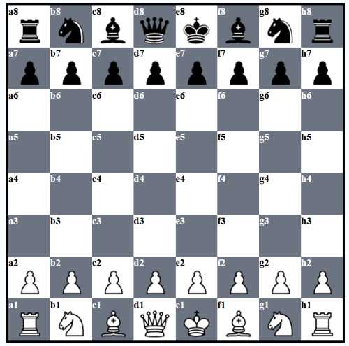
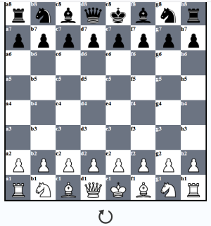

<h1>Chess Game</h1>

  
  

<picture></picture>

## Description
> 

## Reason For Making
> 

## How To Use

## Author

👤 **Chiahao Chou**

## Built With
* HTML5
* CSS3
* Javascript
* Browserify
* Chess.js

## Features
<picture></picture>

## Social Media

## Show your support

Give a ⭐️ if this project helped you!

***
_This README was generated with ❤️ by [readme-md-generator](https://github.com/kefranabg/readme-md-generator)_