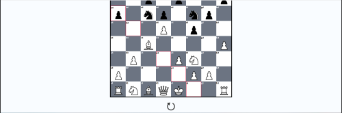

<h1>Chess Game</h1>

  
  

<picture align = "center"></picture>

## Description
> Made using vanilla JS, HTML, and CSS. Chess engine for the browser. User vs. User.

## Reason For Making

## Author

👤 **Chiahao Chou**

## Show your support

Give a ⭐️ if this project helped you!

***
_This README was generated with ❤️ by [readme-md-generator](https://github.com/kefranabg/readme-md-generator)_